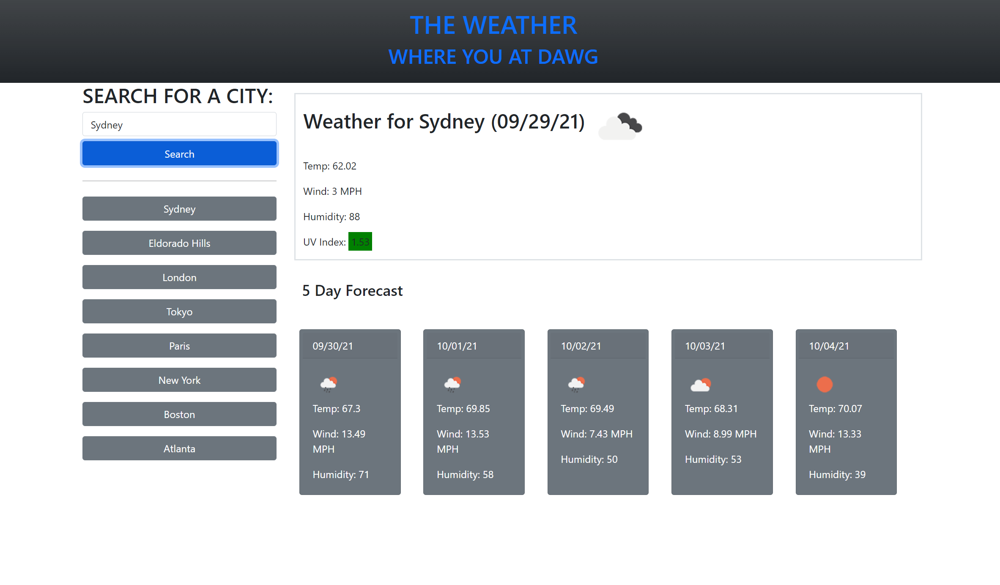

# weather-dashboard
Homework Assignment 06 Due EOD 9/28/2021

This application is intended to allow a user to input a city and display the current conditions as well as a five day forecast. The user's inputs are stored in a list as clickable buttons which will recall that city's particular weather and forecast.

You can find the live application at: https://joshuakwatkins.github.io/weather-dashboard/

